# 03 — Entity Relationship Diagram

Mermaid ER diagram of the core domain (renders on GitHub). Audit/tenancy columns omitted for
clarity — every entity carries `org_id`. See `02-database-schema.md` for full DDL.

```mermaid
erDiagram
    ORG ||--o{ APP_USER : has
    ORG ||--o{ BUILDING : owns
    ORG ||--o{ ASSET_CATEGORY : defines

    APP_USER ||--o{ USER_ROLE : assigned
    ROLE ||--o{ USER_ROLE : grants
    ROLE ||--o{ ROLE_PERMISSION : has
    PERMISSION ||--o{ ROLE_PERMISSION : in

    BUILDING ||--o{ LOCATION_NODE : contains
    LOCATION_NODE ||--o{ LOCATION_NODE : parent_of
    LOCATION_NODE ||--o{ ASSET : holds

    ASSET_CATEGORY ||--o{ ASSET_CATEGORY : parent_of
    ASSET_CATEGORY ||--o{ ASSET : classifies
    ASSET_CATEGORY ||--o{ CUSTOM_FIELD_DEF : extends
    ASSET ||--o{ ASSET : sub_asset
    ASSET ||--|| ASSET_CRITICALITY : rated

    BUILDING ||--o{ DOCUMENT : has
    ASSET ||--o{ DOCUMENT : has
    DOCUMENT ||--o{ DOCUMENT_VERSION : versions
    ASSET ||--o{ MEDIA_ASSET : has
    BUILDING ||--o{ MEDIA_ASSET : has

    ASSET_CATEGORY ||--o{ CHECKLIST_TEMPLATE : applies_to
    CHECKLIST_TEMPLATE ||--o{ CHECKLIST_ITEM_DEF : has
    CHECKLIST_TEMPLATE ||--o{ INSPECTION : instantiated_as
    ASSET ||--o{ INSPECTION : inspected_by
    INSPECTION ||--o{ INSPECTION_RESPONSE : records
    CHECKLIST_ITEM_DEF ||--o{ INSPECTION_RESPONSE : answered_in

    ASSET ||--o{ FAULT : reports
    ASSET ||--o{ PM_PLAN : scheduled_for
    CHECKLIST_TEMPLATE ||--o{ PM_PLAN : uses
    FAULT ||--o{ WORK_ORDER : triggers
    PM_PLAN ||--o{ WORK_ORDER : generates
    ASSET ||--o{ WORK_ORDER : targets
    APP_USER ||--o{ WORK_ORDER : assigned
    CONTRACTOR ||--o{ WORK_ORDER : assigned
    WORK_ORDER ||--o{ WORK_ORDER_PART : consumes

    SPARE_PART ||--o{ WORK_ORDER_PART : used_in
    SPARE_PART ||--o{ PART_STOCK : stocked_as
    WAREHOUSE ||--o{ PART_STOCK : holds
    SPARE_PART ||--o{ PART_COMPAT : fits
    ASSET_CATEGORY ||--o{ PART_COMPAT : compatible
    SPARE_PART ||--o{ STOCK_TXN : moves
    WAREHOUSE ||--o{ STOCK_TXN : at

    BUILDING ||--o{ HSE_INCIDENT : at
    HSE_INCIDENT ||--o{ HSE_CAPA : resolved_by
    ASSET ||--o{ COMPLIANCE_ITEM : monitored
    BUILDING ||--o{ UTILITY_READING : metered

    ORG ||--o{ CHANGE_LOG : streams
    ORG ||--o{ AUDIT_EVENT : logs
    APP_USER ||--o{ NOTIFICATION : receives

    ORG {
      uuid id PK
      text name
      text plan
    }
    APP_USER {
      uuid id PK
      uuid org_id FK
      text email
      text full_name
      bool mfa_enabled
      text status
    }
    BUILDING {
      uuid id PK
      uuid org_id FK
      text code
      text name
      geography geom
      int floors_count
      text status
    }
    LOCATION_NODE {
      uuid id PK
      uuid building_id FK
      uuid parent_id FK
      text node_type
      ltree path
    }
    ASSET_CATEGORY {
      uuid id PK
      uuid parent_id FK
      text name
    }
    ASSET {
      uuid id PK
      uuid building_id FK
      uuid location_node_id FK
      uuid category_id FK
      text asset_code
      text qr_uid
      text criticality
      jsonb attributes
    }
    CUSTOM_FIELD_DEF {
      uuid id PK
      text owner_type
      uuid owner_id
      text key
      text data_type
    }
    CHECKLIST_TEMPLATE {
      uuid id PK
      text name
      text frequency
    }
    CHECKLIST_ITEM_DEF {
      uuid id PK
      uuid template_id FK
      text prompt
      text response_type
    }
    INSPECTION {
      uuid id PK
      uuid template_id FK
      uuid asset_id FK
      text status
      uuid op_id
    }
    INSPECTION_RESPONSE {
      uuid id PK
      uuid inspection_id FK
      uuid item_def_id FK
      text result
    }
    FAULT {
      uuid id PK
      uuid asset_id FK
      text priority
      text status
    }
    PM_PLAN {
      uuid id PK
      uuid asset_id FK
      text trigger_type
      date next_due_date
    }
    WORK_ORDER {
      uuid id PK
      text wo_number
      text type
      text status
      uuid assigned_user_id FK
      date due_date
    }
    SPARE_PART {
      uuid id PK
      text part_number
      numeric reorder_level
    }
    STOCK_TXN {
      uuid id PK
      uuid part_id FK
      text txn_type
      numeric qty
    }
    CONTRACTOR {
      uuid id PK
      text name
      numeric rating
    }
    HSE_INCIDENT {
      uuid id PK
      text type
      text status
    }
    COMPLIANCE_ITEM {
      uuid id PK
      uuid asset_id FK
      date next_inspection_date
      text compliance_status
    }
    UTILITY_READING {
      uuid id PK
      uuid building_id FK
      text utility
      numeric consumption
    }
    AUDIT_EVENT {
      bigint id PK
      uuid actor_user_id
      text action
    }
```

## Cardinality highlights

- **Building → LocationNode → Asset**: a building's twin is a tree of location nodes; assets hang
  off leaf (or any) nodes. `parent_id` self-reference on both `location_node` and `asset` (sub-assets).
- **AssetCategory → CustomFieldDef**: extensibility — categories carry typed field definitions, so
  `asset.attributes` (JSONB) is validated dynamically with **no schema migration** for new types.
- **ChecklistTemplate → Inspection → InspectionResponse**: one template, many runs, many answers.
- **Fault / PM_Plan → WorkOrder**: both corrective and preventive work converge on the work order.
- **SparePart ↔ AssetCategory** (via `part_compat`) and **SparePart → PartStock → Warehouse**:
  many-to-many compatibility and per-warehouse stock levels.
