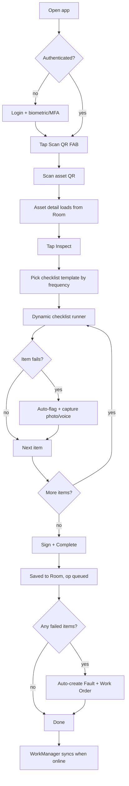
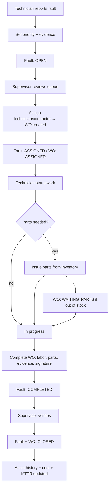
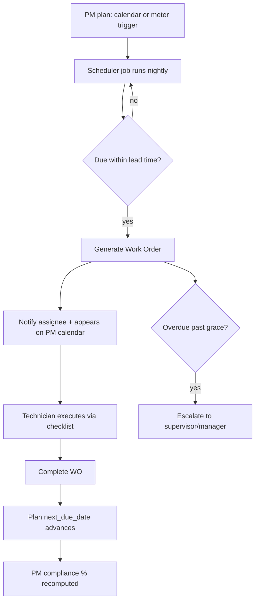
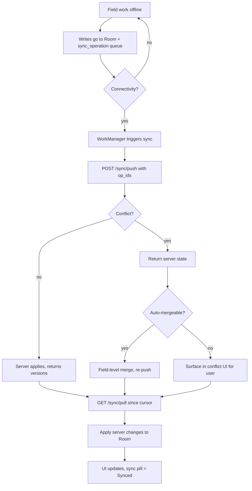
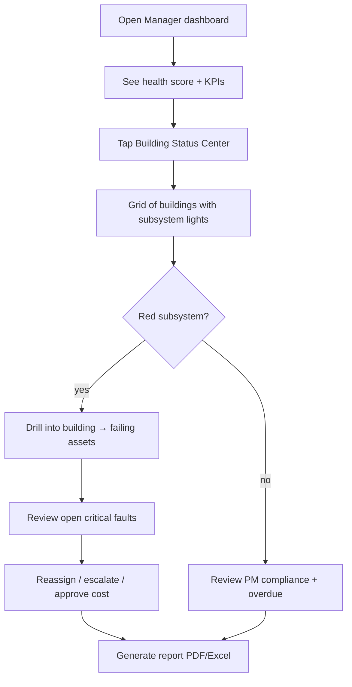
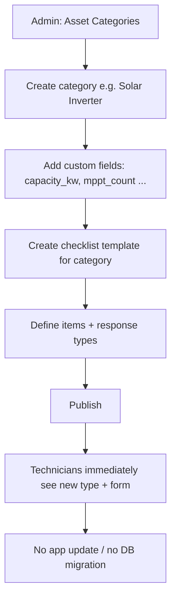

# 06 — User Flows

Primary journeys per role, as Mermaid flowcharts. These define the "happy paths" the UX in
`05-mobile-screens-ux.md` must make fast.

## 1. Technician — scan & inspect (the hot path)

## 2. Corrective maintenance — fault to closure

## 3. Preventive maintenance — auto scheduling

## 4. Offline → online sync

## 5. Manager — building status review

## 6. Admin — add a new asset type (no-code extensibility)

